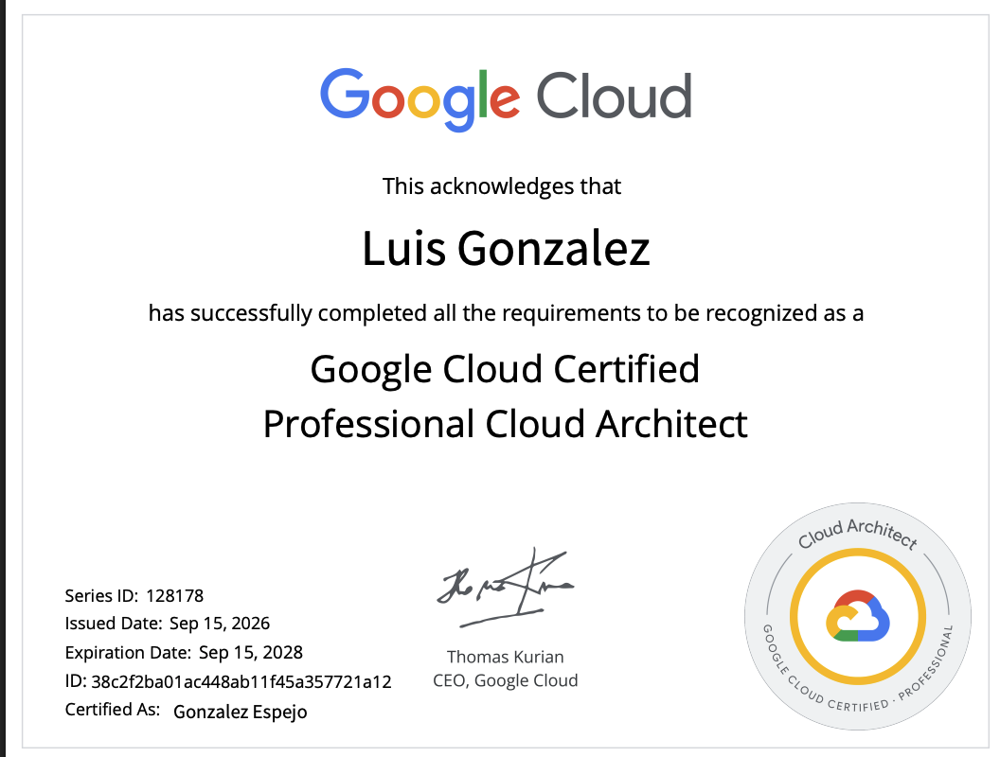

En este post te contaré cómo aprobé la certificación Professional Cloud Architect de GCP, desde mi experiencia, y cómo te puedo aportar en tu camino.

## Mi punto de partida

Mi historia con GCP parte hace 7 años, más o menos. Me cambié de trabajo, donde utilizaban GCP; ya tenía experiencia en algunas nubes como IBM, Pivotal, etc.

Pero básicamente mis experiencias fueron creación de tópicos, SA, Cloud Run, GKE, en ese equipo. Luego fui agregando a mi perfil, pasando de software development a data engineer, y experimenté utilizando Dataflow, BigQuery, Cloud Storage, Firestore y otras soluciones. Pero siempre tenía el bicho de aprender y certificarme como Cloud Architect de GCP; pero cada vez que empezaba a estudiar no lograba enfocarme y dejaba de lado el estudio. Hasta que me comprometí con el [programa de GCP GEAR](https://developers.google.com/program/gear/getcertified).

## El programa GCP GEAR

El programa te entrega 6 clases online, créditos para Cloud Skill, y luego de completar algunos labs necesarios te dan el voucher para rendir la prueba.

En el caso de que no quieras dar la prueba, sugiero no pedir el voucher, porque si lo pides y no lo das, te banean de los futuros programas de GEAR. Luego de pedir el voucher tienes un tiempo acotado para rendir la prueba. Desde que empieza el programa hasta que termina deben ser 4 meses aproximadamente, para que lo tengas en consideración. Esto es lo que indicaba el programa cuando lo hice; revisa las condiciones vigentes en la [página oficial](https://developers.google.com/program/gear/getcertified).

## Recursos que utilicé

Sugiero hacer también el [PATH de Google Skills Boost](https://www.skills.google/paths/12) y, si pueden, hacer el [curso de Udemy](https://www.udemy.com/course/gcp-professional-cloud-architect-exam-prep). Me gustó muchísimo: está súper actualizado y atomizado, la explicación es súper buena y contiene al final algunos mocks de la prueba.

## Los prompts que me ayudaron

Para entender mejor algunos conceptos o herramientas me apoyaba con algún modelo, que puede ser Gemini, Claude, ChatGPT, etc. Por ejemplo, si tenía alguna duda (yo no tengo tanto conocimiento de networking, pero sí de desarrollo de software), aplicaba el siguiente prompt:

> Explícame la diferencia entre PSA y PSC, no soy experto en networking, pero sí en desarrollo de aplicaciones, explícamelo de tal forma que lo pueda entender.

Eso me ayudó a entender mejor algunos conceptos.

## Anki para estudiar en el metro

En el último mes, para ir estudiando en el metro o en los tiempos libres, empecé a usar [AnkiWeb](https://apps.ankiweb.net/), en la que puedes crear flashcards. Lo bueno es que puedes crearlas en la web y luego descargar la app y sincronizarla. Luego puedes hacer test de conceptos y sus explicaciones.

## La última semana

La última semana me dediqué a hacer mocks de pruebas de Udemy, hay bastantes, y a leer diferentes opiniones de la prueba en Reddit, etc., para ver qué se me estaba escapando.

## Lo que más me costó

Lo que más me costó fue networking, por ejemplo la diferencia entre PSA y PSC (lo cuento en la sección de los prompts). Lo otro que me costó fueron los nuevos ítems de IA que incorporaron a la prueba.

## El día del examen

### Elegir el centro y el horario

Cuando seleccionas el día de la prueba, tienes que elegir si es remoto o en un centro de pruebas. El instructor dijo que lo mejor es ir a un centro de pruebas, que puede ser Pearson VUE. Yo elegí el centro de pruebas en Santiago de Chile, cerca del metro Manuel Montt.

Lo hice temprano, ya que el cerebro me funciona mejor en la mañana; lo que me pasaba en las noches es que no lograba concentrarme tanto y estaba muy cansado, al contrario de en la mañana, que estoy más despierto y logro concentrarme mejor. Esto es algo personal, cada uno puede elegir el horario que le convenga.

### La llegada

Llegué al centro, te presentas, das tu carnet, te dan un locker para dejar tus cosas y entras a un laboratorio de computadores, donde uno es el de tu examen. Puede haber más personas y pueden estar haciendo ruido, ten en cuenta si te molestan los ruidos. Por mi parte, me concentro y no presto atención a los ruidos.

### Durante el examen

Empecé a responder las preguntas más fáciles, con menos texto, para agarrar ritmo y confianza. Si tienes alguna duda, puedes marcarla para responderla después. Luego de agarrar ritmo fui a los casos de uso y al final a las que tenía marcadas.

Te dan 2 horas y luego de 1:30 h ya tenía completa la prueba. Creo que mentalmente no alcanzaba a revisar todas las preguntas de nuevo, así que la entregué.

### El resultado

Luego de un par de clics te dan el resultado y salió PASS. Estaba súper feliz de haber aprobado, y más orgulloso del proceso. Yo creo que, si no hubiera pasado, también estaría orgulloso, por el compromiso.

Luego salí de la sala y la persona encargada me dio el papel con el resultado. Google no te da el porcentaje, solo el mensaje. Después, más en la tarde, me llegó el correo de Credly con el certificado. Creo que fue más rápido que hacerlo desde la casa.

## Qué haría diferente

Esta certificación, pensándolo bien, la tenía que haber hecho al principio, ya que te da un panorama más global de GCP y de cada una de las herramientas; te ayuda a tener un big picture de todo. Una lección aprendida para los nuevos desafíos.

Qué hubiera hecho diferente: yo creo que con una semana de pruebas más hubiera estado más seguro. Dejar los pensamientos negativos, pensar que te falta mucho por estudiar, que no vas a alcanzar, reemplazarlos por mensajes positivos: vamos, que estás aprendiendo cosas nuevas, no importa si pasas o no, lo importante es el proceso.

## Lo que viene

Se cierra un proceso y se vendrán más. En lo que me gustaría enfocarme es en las certificaciones Agentic Architecture; adoptar estas nuevas tecnologías es esencial para los futuros productos o herramientas.

## Enlaces

- [Programa GCP GEAR](https://developers.google.com/program/gear/getcertified)
- [PATH de Google Skills Boost](https://www.skills.google/paths/12)
- [Curso de Udemy: GCP Professional Cloud Architect exam prep](https://www.udemy.com/course/gcp-professional-cloud-architect-exam-prep)
- [AnkiWeb](https://apps.ankiweb.net/)

Si tienes dudas o quieres contarme tu experiencia, déjala en los comentarios.
